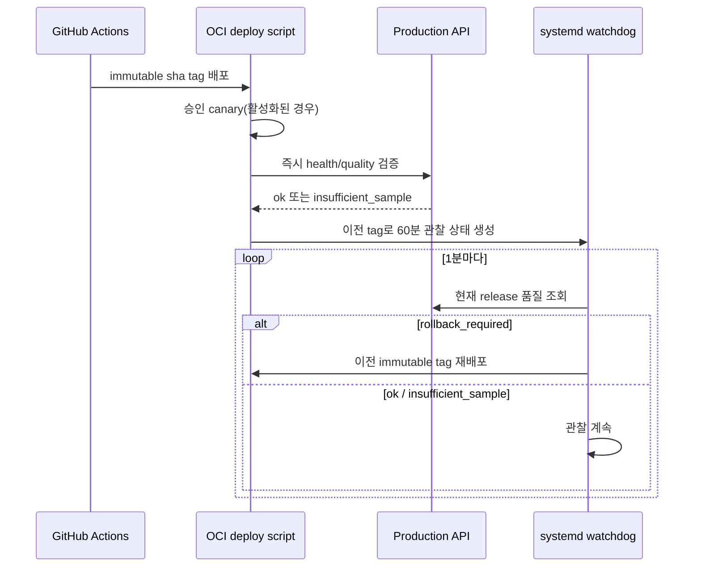

# 모델·모바일 통합 구현 기록

최종 업데이트: 2026-09-07

브랜치: `feat/model-mobile-v1`

기준 브랜치: GitHub `main`

## 확정된 방향

- 모델 계산 코드는 `Oracle_Project/sehyeon`의 커밋
  `dcc2d7d7a7eaacb8b2828745d31a5b375c5b893b`을 기준으로 한다.
- 원본 모델 파일을 플러그인 단위로 보존하고, OCI 경로·단계 기록·결과 변환은
  서비스 어댑터가 담당한다.
- 사용자는 앱 설치 직후 게스트로 분석할 수 있고, 원하면 Kakao 계정으로
  전환한다.
- 앱은 React Native + Expo Router이며, 참고 UI의 색상·정보 구조를 모바일
  컴포넌트로 구현한다.
- 추가 VM이나 별도 DB를 만들지 않고 현재 Production API/PostgreSQL/Object
  Storage를 공유한다.
- 모델 품질 저하, 잘못된 산출물, 장시간 처리를 자동 롤백 신호에 포함한다.

## 구현 완료

### 모델 플러그인

`coach/model_plugins/sehyeon-dcc2d7d/`에 원본 HPE, pose tracking, feature,
paper, prompt, Agent 코드를 보존했다. 플러그인에는 다음 메타데이터도 있다.

- `model_manifest.json`: 원본 commit, 입출력 계약, 가중치 경로와 SHA-256
- `quality_baseline.json`: 필수 feature, 단위·범위, 추적률, 처리시간 기준
- `README.md`: 원본과 서비스 어댑터의 경계

`COACH_MODEL_ID`로 플러그인을 선택한다. HPE와 feature wrapper는 선택된
플러그인의 엔트리포인트를 실행하고, 기존 서비스 기능인 `/workspace` 경로,
MP4/MOV 탐색, H.264 변환, 단계 로그와 결과 계약 검사는 유지한다.

원본 Agent는 플러그인에 그대로 보존했지만 기본 실행에는 서비스용 Agent
adapter를 사용한다. 원본은 `_OPENAI_API_KEY`, `gpt-5-nano`, 로컬 `Coach/run`
경로에 고정되어 있어 OCI에 그대로 실행할 수 없기 때문이다. adapter는
`OPENAI_API_KEY`, `COACH_LLM_MODEL`, `/workspace/run`을 사용한다. LLM은 수치
계산이 아닌 선택적 한국어 설명 생성에만 관여하며 기본값은
`gpt-5.6-luna`다.

### 모바일 API와 인증

`/api/mobile/v1` 계약과 Expo 앱을 구현했다.

- 게스트: 앱이 Bearer token을 발급받아 SecureStore에 저장한다.
- Kakao: system browser OAuth, 서버 callback, 일회용 exchange code, native
  deep link 순서로 계정 세션을 발급한다.
- API key는 앱에 포함하지 않는다. Production Nginx가 내부 요청에만
  `X-API-Key`를 주입한다.
- 사용자별 프로필 키, signed upload, 작업 생성·조회, 단계 polling, 결과와
  만료형 영상 URL을 지원한다.
- 작업과 결과에 `modelId`, `modelRelease`를 반환해 어떤 모델과 immutable
  image가 분석했는지 추적한다.

DB migration `009_model_release_quality.sql`은 작업에 모델 ID, 릴리스 tag,
산출물 검증 상태를 추가한다. migration은 API 시작 시 advisory lock 아래
additive 방식으로 적용된다.

### Expo Android 배포

`mobile/eas.json`에 다음 profile을 추가했다.

- `development`: development client 내부 APK
- `preview`: 테스터가 직접 설치할 수 있는 EAS internal APK
- `production`: Android store 배포용 profile

모든 profile은 기존 Production API를 사용한다. Expo 계정의 project ID와
Android signing credential은 저장소에 넣지 않으며, 프로젝트 소유자가
`eas init`과 최초 build에서 연결한다.

### 품질 판정과 자동 롤백

품질 집계는 전체 과거 작업이 아니라 현재 `MODEL_RELEASE`와 일치하는 작업만
사용한다.

| 조건 | 기본 기준 | 표본 3건 미만 |
|---|---:|---|
| 잘못된 산출물 | 1건 이상 | 즉시 롤백 신호 |
| 장시간 QUEUED/PROCESSING | 3,600초 초과 1건 이상 | 즉시 롤백 신호 |
| 성공률 저하 | 95% 미만 | 판정 보류 |
| 실패율 증가 | 10% 초과 | 판정 보류 |

배포 직후 완료 표본이 부족한 `insufficient_sample`은 정상적인 관찰 상태다.
배포 검증기는 `ok`와 `insufficient_sample`을 허용하지만, 릴리스 tag가 다르거나
rollback condition이 있으면 실패한다.

성공한 새 배포는 이전 immutable tag와 함께 60분 watchdog을 자동으로
설정한다. systemd timer가 1분마다 품질 endpoint를 확인하고 HTTP 503과
`rollback_required`를 함께 확인했을 때만 이전 tag로 배포한다. 네트워크 오류나
잘못된 응답만으로는 모델을 롤백하지 않고 다음 실행에서 재시도한다.

모델러 승인 golden 영상이 준비되면 `MODEL_CANARY_REQUIRED=1`로 전환한다.
배포기는 모델 image로 golden 영상을 실제 처리한 뒤 승인 baseline과 결과를
비교하며, 실패하면 Production container 교체 전에 배포를 중단한다. 개인 영상은
GitHub에 올리지 않고 `/opt/runners-feed/model-golden/<model_id>/`에 둔다.

### CI와 운영 자동화

- PR CI: API, worker, frontend, Compose, 모델 quality gate, Expo typecheck
- Release CI: 모델 gate, image build/test/push, Production 배포·검증
- CI disk guard: 75% 이상에서 24시간 초과 미사용 container/image/build cache
  정리, 90% 이상이면 build 중단; Docker volume은 삭제하지 않는다.
- systemd unit sync: 인증서, DB backup/restore 검증, model watchdog unit을
  allowlist로 자동 설치·활성화한다.

## 검증 현황

- Python 전체 compile: 통과
- API unit test 44개: 전체 requirements 격리 환경에서 통과
- Worker deterministic unit test 24개: 통과
- 배포 즉시 검증 shell test: 통과
- 배포 실패 rollback shell test: 통과
- 60분 watchdog shell test: 통과
- 모델 원본 대조: 의미 있는 내용 차이 없음(줄 끝 공백과 마지막 개행만 정규화)
- 로컬 API test: OCI SDK가 없는 호스트에서 import 3건만 실행 불가; 나머지 통과
- Docker Compose와 image test: 로컬 Docker 미설치로 GitHub CI에서 실행 예정
- Expo typecheck: 통과
- Expo Doctor: 21/21 통과
- Production dependency audit: high/critical 없음, Expo transitive dependency의
  moderate 13건은 강제 수정 시 SDK 호환성이 깨져 현재 버전을 유지

## 배포 전에 남은 항목

- 모델러가 golden 영상·반복 실행 기준값을 승인하고
  `quality_baseline.json`의 `approval_status`를 `approved`로 변경
- Kakao Developers에 mobile server callback URI 등록
- Expo 소유자 계정으로 `eas init` 후 preview APK build
- GitHub required checks에 `Model contract and quality gate`,
  `Mobile Expo typecheck` 추가
- Production 환경변수와 systemd sudo 권한 점검
- 새 migration 적용 전 DB backup 실행

배포 후에는 14일 안정성 관찰을 새 배포일부터 다시 계산한다. 그 기간에는
레거시 경로, 오래된 release, 로컬 Docker image를 삭제하지 않는다.

상세 모델 전달 규격은 [`MODEL_HANDOFF.md`](MODEL_HANDOFF.md), 모바일 endpoint와
EAS 절차는 [`MOBILE_API.md`](MOBILE_API.md)를 참고한다.
